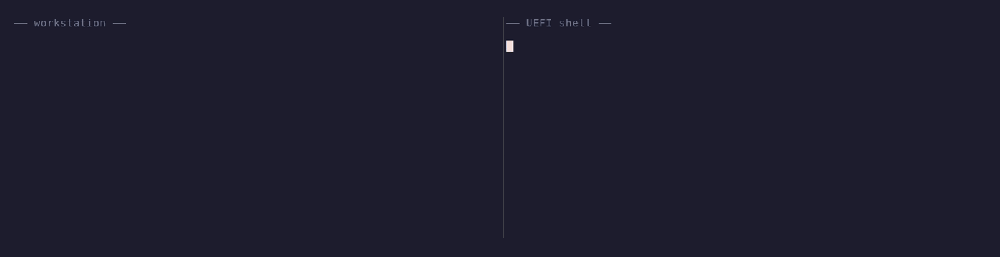
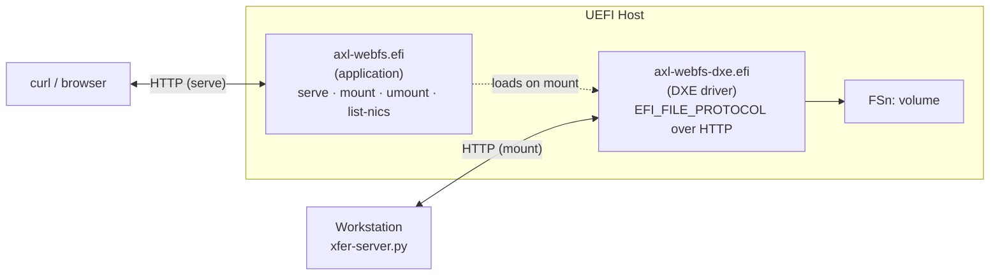

<div align="center">

# axl-webfs

**Mount your laptop as a UEFI volume. Serve UEFI files over HTTP.**

[](LICENSE)
[](https://github.com/aximcode/axl-webfs/releases)
[](https://github.com/aximcode/axl-sdk-releases)



</div>

## What it does

axl-webfs is a UEFI toolkit for bidirectional file transfer between a
workstation and a UEFI host. No USB sticks, no BMC virtual media, no
`.efi` shuffling — build on your workstation, run immediately in the
UEFI Shell.

Two commands:

- **`mount <url>`** — mount a workstation directory as a UEFI volume
  (`FSn:`). The Shell can read, write, and execute files in real time.
- **`serve`** — run an HTTP file server on the UEFI host, exposing
  local volumes to `curl`, browsers, or network drive mounts.

Plus `umount` and `list-nics`.

## Quick start

On the workstation, serve a directory:

```bash
./scripts/xfer-server.py --root /path/to/efi/tools
```

In the UEFI Shell, mount it and run something off it:

```
FS0:\> axl-webfs.efi mount http://10.0.0.5:8080/
FS0:\> ls fs1:
FS0:\> fs1:\IpmiTool.efi
```

## Install

axl-webfs builds against [AximCode's AXL SDK](https://github.com/aximcode/axl-sdk-releases)
(no EDK2). Install a prebuilt SDK package — this gives you `axl-cc`,
headers, and the UEFI target libs for x64 and aa64.

**Debian / Ubuntu:**

```bash
curl -LO https://github.com/aximcode/axl-sdk-releases/releases/latest/download/axl-sdk.deb
sudo apt install ./axl-sdk.deb
```

**Fedora / RHEL:**

```bash
curl -LO https://github.com/aximcode/axl-sdk-releases/releases/latest/download/axl-sdk.rpm
sudo dnf install ./axl-sdk.rpm
```

Packages install under `/usr`. To build against a local SDK checkout
instead:

```bash
AXL_SDK=~/src/axl-sdk-releases/out make
```

## Build

```bash
make                 # axl-webfs.efi and axl-webfs-dxe.efi for x64
make ARCH=aa64       # AArch64
make clean
```

Output lands in `build/axl/<arch>/`.

## Architecture



Two binaries, both built with `axl-cc`. All HTTP, JSON, event loop,
hash table, and network functionality comes from the AXL SDK.

See [docs/Design.md](docs/Design.md) for the full design.

## Use cases

- **Live development** — mount build output, run freshly compiled
  `.efi` files without manual transfer.
- **ARM64 server bootstrapping** — mount tools on ARM64 servers where
  virtual media is unreliable.
- **Log extraction** — `serve` lets you pull crash dumps, SMBIOS
  tables, or any file from the EFI System Partition via `curl`.
- **Bulk deployment** — upload or download entire directory trees.

## Command reference

### `mount` / `umount`

```
axl-webfs.efi mount <url>
axl-webfs.efi umount [handle]
```

### `serve`

```
axl-webfs.efi serve [-p port] [-n nic] [-t timeout]
                    [--read-only] [--write-only] [-v]
```

<details>
<summary>Flag details</summary>

| Flag | Default | Description |
|------|---------|-------------|
| `-p` | 8080 | Listen port |
| `-n` | auto | NIC index (use `list-nics` to find) |
| `-t` | 0 | Idle timeout in seconds (0 = never) |
| `--read-only` | off | Block uploads and deletes |
| `--write-only` | off | Block downloads |
| `-v` | off | Verbose logging |

</details>

### `list-nics`

Prints NIC index, MAC, link status, and IP for every interface
axl-webfs can see. Use this to pick a `-n` value for `serve` or to
diagnose connectivity.

### Workstation server: `xfer-server.py`

The companion for `mount`. Python 3 stdlib only, no external deps.

```bash
./scripts/xfer-server.py                             # current directory
./scripts/xfer-server.py --root /path --port 9090    # custom root/port
./scripts/xfer-server.py --read-only                 # block uploads/deletes
```

## Testing

```bash
scripts/test.sh              # host-side tests against xfer-server.py
scripts/test.sh --qemu       # add QEMU integration tests (X64)
scripts/test.sh --aarch64    # add AARCH64 QEMU tests
```

QEMU tests use `run-qemu.sh`, which ships with the AXL SDK source
tree but not the `.deb`/`.rpm`. Point `AXL_SDK_SRC` at an
[axl-sdk-releases](https://github.com/aximcode/axl-sdk-releases)
checkout to enable them:

```bash
AXL_SDK_SRC=~/src/axl-sdk-releases scripts/test.sh --qemu
```

## Platform notes

On ARM64 hardware (e.g. some ARM64 servers) firmware may not
auto-connect the network stack. axl-webfs handles this by calling
`ConnectController` on SNP handles before NIC discovery. Use
`list-nics` to verify link status if networking isn't working.

## Regenerating the demo GIF

The GIF above is produced from [docs/assets/demo-mount.tape](docs/assets/demo-mount.tape)
using [vhs](https://github.com/charmbracelet/vhs). To rebuild it after
editing the narrative scripts:

```bash
make demo
```

Requires `vhs`, `ttyd`, `tmux`, and `ffmpeg` on `PATH`.

## Contributing and security

- [CONTRIBUTING.md](CONTRIBUTING.md) — build, test, and patch-review
  conventions.
- [SECURITY.md](SECURITY.md) — how to report vulnerabilities.

## License

Apache-2.0 — see [LICENSE](LICENSE) and [NOTICE](NOTICE).

Built on the [AXL SDK](https://github.com/aximcode/axl-sdk-releases).
