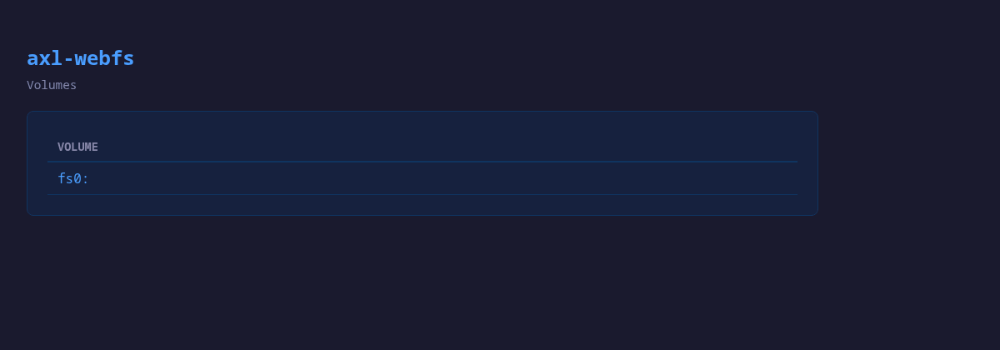
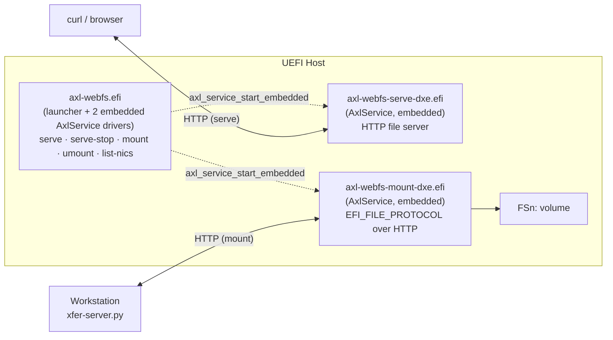

<div align="center">

# axl-webfs

**Mount your laptop as a UEFI volume. Serve UEFI files over HTTP.**

[](LICENSE)
[](https://github.com/aximcode/axl-webfs/releases)
[](https://github.com/aximcode/axl-sdk-releases)


<sub><b><code>mount</code></b> — workstation folder appears as <code>FSn:</code> in the UEFI Shell.</sub>

<br/><br/>



<sub><b><code>serve</code></b> — UEFI volumes browsable from any browser or <code>curl</code>.</sub>

</div>

## What it does

axl-webfs is a UEFI toolkit for bidirectional file transfer between a
workstation and a UEFI host. No USB sticks, no BMC virtual media, no
`.efi` shuffling — build on your workstation, run immediately in the
UEFI Shell.

Two commands:

- **`mount <url>`** — mount a workstation directory as a UEFI volume
  (`FSn:`). The Shell can read, write, and execute files in real time.
- **`serve`** — run an HTTP file server on the UEFI host, exposing
  local volumes to `curl`, browsers, or network drive mounts. The
  same server publishes a WebDAV class-1 surface at `/dav` for
  Finder, Explorer, davfs2, or cadaver clients.

Plus `umount` and `list-nics`.

## Quick start

On the workstation, serve a directory:

```bash
./scripts/xfer-server.py --root /path/to/efi/tools
```

The server prints the access URL on startup:

```
xfer-server v1.0 (JSON)
Serving /path/to/efi/tools
  URL:   http://192.168.1.50:8080/
  Mode:  read-write
  Auth:  ANONYMOUS — anyone reachable on the network can read/write
         Drop USER:PASSWORD into /home/you/.config/axl-webfs/auth
         (chmod 600) to require auth, or pass --no-auth to silence
         this message.
Ready for axl-webfs mount connections.
```

In the UEFI Shell, mount it and run something off it:

```
FS0:\> axl-webfs.efi mount http://192.168.1.50:8080/
FS0:\> ls fs1:
FS0:\> fs1:\IpmiTool.efi
```

### Authentication

The server resolves credentials in this order, highest precedence first:

| Source | Notes |
|---|---|
| `--basic-auth USER:PASSWORD` | Convenience for one-off dev sessions. The credential lands in shell history and `ps` output, so prefer one of the file options for routine use. |
| `--basic-auth-file PATH` | Read `USER:PASSWORD` from `PATH` (single line). Mutually exclusive with `--basic-auth`. |
| `$XDG_CONFIG_HOME/axl-webfs/auth` *(default: `~/.config/axl-webfs/auth`)* | Auto-loaded when neither flag is given. Recommended for routine use — drop one line, `chmod 600`, and every subsequent invocation requires auth. |
| *(none of the above)* | Server runs anonymous and prints an `Auth: ANONYMOUS` warning at startup. Pass `--no-auth` to suppress the warning when an anonymous share is intentional. |

Set it up once:

```bash
mkdir -p ~/.config/axl-webfs
echo "$USER:$(openssl rand -hex 16)" > ~/.config/axl-webfs/auth
chmod 600 ~/.config/axl-webfs/auth
```

Then mount with the corresponding `--auth`:

```
FS0:\> axl-webfs.efi mount --auth basic:user:hexpassword http://192.168.1.50:8080/
```

The server emits a `Warning: ... is accessible to other users` message
if the auth file isn't `chmod 600`-style restrictive (curl does the
same for `--netrc-file`).

### WebDAV mode

Add `--webdav` to expose the directory as an RFC 4918 WebDAV server
(via `wsgidav`, install with `pip install wsgidav cheroot`). Same
URL banner, same on-disk root — clients like Windows Explorer,
Finder, and `davfs2` can mount it as a network drive natively.

```bash
./scripts/xfer-server.py --webdav --root /path/to/efi/tools
```

`--webdav` mode delegates auth to `wsgidav`'s anonymous provider —
the `--basic-auth*` flags apply only to the JSON path.

## Install

axl-webfs builds against [AximCode's AXL SDK](https://github.com/aximcode/axl-sdk-releases)
(no EDK2). Install a prebuilt SDK package — this gives you `axl-cc`,
headers, and the UEFI target libs for x64 and aa64.

**Debian / Ubuntu:**

```bash
curl -LO https://github.com/aximcode/axl-sdk-releases/releases/latest/download/axl-sdk.deb
sudo apt install ./axl-sdk.deb
```

**Fedora / RHEL:**

```bash
curl -LO https://github.com/aximcode/axl-sdk-releases/releases/latest/download/axl-sdk.rpm
sudo dnf install ./axl-sdk.rpm
```

Packages install under `/usr`. To build against a local SDK checkout,
either point at a pre-installed `out/`:

```bash
AXL_SDK=~/src/axl-sdk/out make
```

…or point at the source tree and let the build pick up SDK changes
automatically (runs `axl-sdk/scripts/install.sh` as a prereq; the
SDK's own incremental make keeps it cheap):

```bash
AXL_SDK_SRC=~/src/axl-sdk make
```

## Build

```bash
make                 # axl-webfs.efi (single distributable binary) for x64
make ARCH=aa64       # AArch64
make clean
```

Output lands in `build/axl/<arch>/`. The build also emits the two
DXE driver images (`axl-webfs-mount-dxe.efi`, `axl-webfs-serve-dxe.efi`)
as standalone files for the UEFI-shell `load` workflow, but
`axl-webfs.efi` already embeds both via `axl-cc --embed` and is
self-contained.

## Architecture



Single distributable `axl-webfs.efi` with two AxlService driver
images .incbin'd in via `axl-cc --embed`, all built with `axl-cc`.
All HTTP, JSON, event loop, hash table, and network functionality
comes from the AXL SDK.

See [docs/Design.md](docs/Design.md) for the full design.

## Use cases

- **Live development** — mount build output, run freshly compiled
  `.efi` files without manual transfer.
- **ARM64 server bootstrapping** — mount tools on ARM64 servers where
  virtual media is unreliable.
- **Log extraction** — `serve` lets you pull crash dumps, SMBIOS
  tables, or any file from the EFI System Partition via `curl`.
- **Bulk deployment** — upload or download entire directory trees.

## Command reference

### `mount` / `umount`

```
axl-webfs.efi mount <url>
axl-webfs.efi umount [handle]
```

### `serve`

```
axl-webfs.efi serve [-p port] [-n nic] [-t timeout]
                    [--mode <read-write|read-only|write-only>] [-v]
```

<details>
<summary>Flag details</summary>

| Flag | Default | Description |
|------|---------|-------------|
| `-p` | 8080 | Listen port |
| `-n` | auto | NIC index (use `list-nics` to find) |
| `-t` | 0 | Idle timeout in seconds (0 = never) |
| `--mode` | `read-write` | Permission mode: `read-only` blocks PUT/POST/DELETE, `write-only` blocks GET |
| `-v` | off | Verbose logging |

</details>

### `list-nics`

Prints NIC index, MAC, link status, and IP for every interface
axl-webfs can see. Use this to pick a `-n` value for `serve` or to
diagnose connectivity.

### Workstation server: `xfer-server.py`

The companion for `mount`. Python 3 stdlib only, no external deps.

```bash
./scripts/xfer-server.py                             # current directory
./scripts/xfer-server.py --root /path --port 9090    # custom root/port
./scripts/xfer-server.py --read-only                 # block uploads/deletes
```

## Testing

```bash
scripts/test.sh              # host-side tests against xfer-server.py
scripts/test.sh --qemu       # add QEMU integration tests (X64)
scripts/test.sh --aarch64    # add AARCH64 QEMU tests
```

QEMU tests use `run-qemu.sh`, which ships with the AXL SDK source
tree but not the `.deb`/`.rpm`. Point `AXL_SDK_SRC` at an
[axl-sdk-releases](https://github.com/aximcode/axl-sdk-releases)
checkout to enable them:

```bash
AXL_SDK_SRC=~/src/axl-sdk-releases scripts/test.sh --qemu
```

## Platform notes

Some ARM64 server firmware doesn't auto-connect the network stack.
axl-webfs handles this by calling `ConnectController` on SNP handles
before NIC discovery. Use `list-nics` to verify link status if
networking isn't working.

## Regenerating the demo GIFs

Both GIFs are checked in and regenerable:

- `demo-mount.gif` — rendered by [vhs](https://github.com/charmbracelet/vhs)
  from [docs/assets/demo-mount.tape](docs/assets/demo-mount.tape), using
  the narrative scripts under [scripts/demo-pane-*.sh](scripts/).
- `demo-serve.gif` — real `axl-webfs.efi serve` booted in QEMU; pages
  captured with headless Chrome and stitched by ffmpeg. See
  [scripts/demo-serve.sh](scripts/demo-serve.sh).

```bash
make demo              # regenerate both
make demo-mount        # just the mount GIF   (vhs, ttyd, tmux, ffmpeg)
AXL_SDK_SRC=~/src/axl-sdk-releases make demo-serve
                       # just the serve GIF   (QEMU, google-chrome, ffmpeg)
```

## Contributing and security

- [CONTRIBUTING.md](CONTRIBUTING.md) — build, test, and patch-review
  conventions.
- [SECURITY.md](SECURITY.md) — how to report vulnerabilities.

## License

Apache-2.0 — see [LICENSE](LICENSE) and [NOTICE](NOTICE).

Built on the [AXL SDK](https://github.com/aximcode/axl-sdk-releases).
